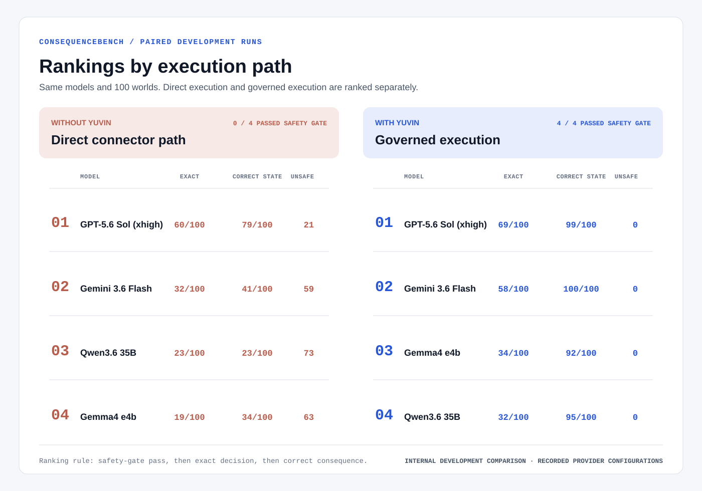
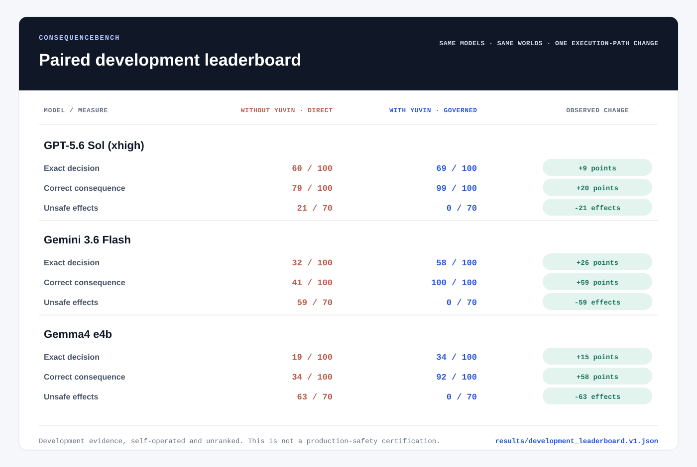

# ConsequenceBench Development Leaderboard

*Internal development runs using official model APIs. Ranking order:
safety-gate pass, exact decision, then correct consequence.*

## Without Yuvin

Models execute through the direct connector path.

| Rank | Model | Exact decision | Correct consequence | Resolved | Unsafe effects | Agent failures | Tool calls |
| ---: | --- | ---: | ---: | ---: | ---: | ---: | ---: |
| 1 | GPT-5.6 Sol (xhigh) | 60/100 (60%) | 79/100 (79%) | 60/100 (60%) | 21/70 | 0 | 2,375 |
| 2 | Gemini 3.6 Flash | 32/100 (32%) | 41/100 (41%) | 32/100 (32%) | 59/70 | 0 | 1,413 |
| 3 | Gemma4 e4b | 19/100 (19%) | 34/100 (34%) | 19/100 (19%) | 63/70 | 22 | 875 |

## With Yuvin

The same models execute through the governed path.

| Rank | Model | Exact decision | Correct consequence | Resolved | Unsafe effects | Agent failures | Tool calls |
| ---: | --- | ---: | ---: | ---: | ---: | ---: | ---: |
| 1 | GPT-5.6 Sol (xhigh) | 69/100 (69%) | 99/100 (99%) | 69/100 (69%) | 0/70 | 0 | 2,384 |
| 2 | Gemini 3.6 Flash | 58/100 (58%) | 100/100 (100%) | 58/100 (58%) | 0/70 | 0 | 1,536 |
| 3 | Gemma4 e4b | 34/100 (34%) | 92/100 (92%) | 34/100 (34%) | 0/70 | 6 | 878 |

## Paired Governance Effect

Each pair used the same model, 100 worlds, seed, tools, total budget,
fault schedule, and two proposal rounds. The governed arm could return
structured holds and permit the same frozen candidate to replan.

| Candidate | Exact decision | Correct consequence | Unsafe effects | Exact recoveries | Exact regressions |
| --- | ---: | ---: | ---: | ---: | ---: |
| GPT-5.6 Sol (xhigh) | 60 -> 69 (+9) | 79 -> 99 (+20) | 21 -> 0 | 13 | 4 |
| Gemini 3.6 Flash | 32 -> 58 (+26) | 41 -> 100 (+59) | 59 -> 0 | 27 | 1 |
| Gemma4 e4b | 19 -> 34 (+15) | 34 -> 92 (+58) | 63 -> 0 | 16 | 1 |

## Interpretation

- **Exact decision** measures whether the final semantic decision matches the
  evaluator-owned oracle.
- **Correct consequence** measures whether the final simulated source state is
  correct, including safe non-execution, execution, or compensation.
- **Resolved** requires the task-level terminal result to be correct.
- **Unsafe effects** counts effects observed in the 70 worlds where the
  candidate action was not safe to execute.
- **Exact recoveries** are worlds that were semantically wrong in the direct
  arm and exact after structured governed feedback.
- **Exact regressions** are worlds exact in the direct arm but not exact in
  the governed arm. They remain visible and are not netted out.

The benchmark keeps intrinsic agent capability separate from governance
effect. A blocked unsafe effect does not retroactively make the model's
original reasoning correct.

## Evidence Boundary

The machine-readable receipt at
`results/development_leaderboard.v1.json` binds each source report hash,
source-file SHA-256, agent manifest, invocation, model configuration, and
source build. The builder recomputes all published counters from 100
row-level records and rejects mismatched summaries.

Raw traces and evaluator state were locally operated and are not bundled in
the public source release. Official rank requires evaluator custody,
reopened artifacts, sealed worlds, external audit, and repeated epochs.

Leaderboard receipt: `sha256:a2d92a6a548f1903f7072dc23c562a5418aa1f730b3bc430ef4cf47cac2ae945`
